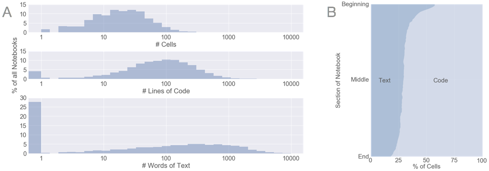
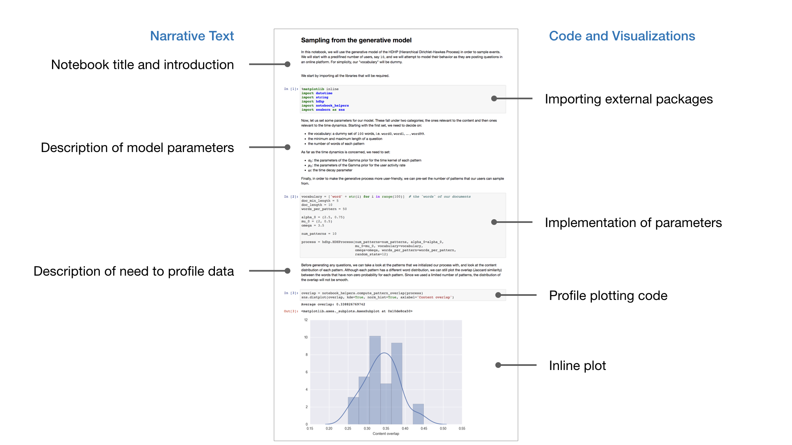

# Jupyter Notebooks on Github
In July 2017 we searched for, downloaded, and analyzed the approximately 1.3
million public Jupyter Notebooks on Github at the time. This repository includes
the scripts used to query and analyze that dataset. The full dataset is now 
[available online](https://library.ucsd.edu/dc/collection/bb6931851t) thanks to 
hosting provided by the UC San Diego Library. The full dataset is nearly 600GB 
so we have created a smaller 5GB sampler dataset for you to get started.

In our analysis, we looked primarily at how notebooks employ narrative (operationalized as
markdown text). Our main finding was that many notebooks (~27%) include no
markdown text and that text occurs more often at the start of notebooks.

See our forthcoming [CHI 2018 publication](http://adamrule.com/files/papers/chi_2018_computational_notebooks_camera_ready.pdf) for a more detailed description of this
analysis, as well as our related study of notebooks published alongside
academic publications and interviews with academic data analysts.

For those unfamiliar with Jupyter Notebooks, they are an interactive computing
environment that enable analysts to combine code, visualizations, and text in a
single, easily shared document. See the example of a notebook below:

